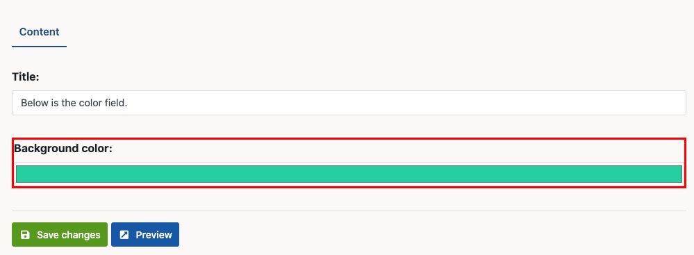

# 📝 Bolt Color Field Extension

This extension allows you to use fields of `type: color` in your 
ContentTypes, as defined in `contenttypes.yaml`.

You can also manipulate colors in Twig, with all the might
of the [Iris PHP Color library](https://github.com/ozdemirburak/iris).

## Installation
```bash
composer require bolt/color
```

-------

## Usage

### Definition

IN your `contenttypes.yaml`, you can define the following field:

```yaml
      background:
          type: color
          label: Background color
```

Which will show up a colorpicker field like this (without red highlight):



### In twig

To get the hex value (`#ff0000`), simply use:

```twig
{{ record.background }} 
```

The [Iris library](https://github.com/ozdemirburak/iris) allows many ways
in which you can manipulate the value of the field, for example:

```twig
{{ record.background.red }} {# get the amount of red #}
{{ record.background.values }} {# array with ['ff', '00', 'ff'] rgb values #}
{{ record.background.lighten(20) }} 
{{ record.background.darken(10) }} 
{{ record.background.dark }} {# true if color is dark #}
{{ record.background.hsl }} {# converts to HSL #}
{{ record.background.rgba }} {# converts to RGBA #}
```
